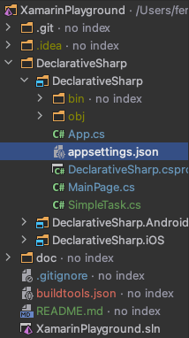

# Xamarin Playground

A test project to try out different aspects in Xamarin development.

## Secrets and app settings management 

1. Install [Mobile.BuildTool](https://github.com/dansiegel/Mobile.BuildTools) Nuget Package in code sharing project (the non-(iOS/Android) platform one).


2. After installing, `.gitignore` will have the following entries:


and `buildtools.json` will be added to project solution root.


3. add `appsettings.json` or `appsettings[.env].json` in non-sharing project root or solution root.



with content like this:


```json
{
  "key": "value"
}
```

4. Edit `buildtools.json`, add the following section at top level:

```json
"appSettings": {
  "DeclarativeSharp": [{
    "accessibility": "Public",
    "namespace": "MyNamespace",
    "className": "MySettings",
    "properties": [{
      "name": "GoogleMapKey",
      "type": "String"
    }]
  }]
},
```
Optional field name | Default value
:---|:--- 
accessibility | Internal
namespace | Helpers
classname | AppSettings

**Note: the section name must be `appSettings` and it must have a property named the same as your project name (the one installed the nuget package). In this case i.e `DeclarativeSharp`** 

The `properties` array should specify what properties the generated class will have. It have to match the key-value pairs specified in following places:

from [MobileBuiltTools](https://mobilebuildtools.com/config/appsettings/):
```
- buildtools.json Environment Defaults
- buildtools.json Environment Configuration (i.e. Debug, Release)
- System Environment
- Recursively load legacy secrets.json from the Project directory to the Solution directory
- Recursively load appsettings.json from the Project directory to the Solution directory
```

The file should look like this afterwards:


5. Clean the whole solution.
6. Build the shared code project (the one with MobileBuildTools Nuget package installed).
7. If everything setup correctly, a static class will be generated in the `obj` folder:


8. Rebuild the `Android` and `iOS` project.
9. You should able to use the app settings in platform project now.

iOS: `AppDelegate.cs`
[use appsetting in iOS](doc/appSettings/mobilebuildtools-ios.png)

Android: `MainActivity.cs`
[use appsetting in Android](doc/appSettings/mobilebuildtools-android.png)

**Note: If the generated class cannot be referenced in platform project, repeat steps 5-9.**
