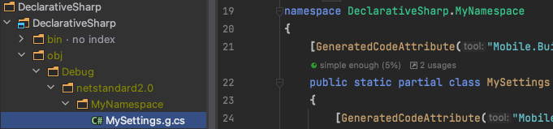

# Xamarin Playground

A test project to try out different aspects in Xamarin.Forms development.

Initial Xamarin.Forms Version: 5.0

## Secrets and app settings management 

1. Install [Mobile.BuildTool](https://github.com/dansiegel/Mobile.BuildTools) Nuget Package in code sharing project (the non-(iOS/Android) platform one).


2. After installing, `.gitignore` will have the following entries:


and `buildtools.json` will be added to project solution root.


3. add `appsettings.json` or `appsettings[.env].json` in non-sharing project root or solution root.


with content like this:


```json
{
  "key": "value"
}
```

4. Edit `buildtools.json`, add the following section at top level:

```json
"appSettings": {
  "DeclarativeSharp": [{
    "accessibility": "Public",
    "namespace": "MyNamespace",
    "className": "MySettings",
    "properties": [{
      "name": "GoogleMapKey",
      "type": "String"
    }]
  }]
},
```
Optional field name | Default value
:---|:--- 
accessibility | Internal
namespace | Helpers
classname | AppSettings
prefix | BuildTools_

**Note: the section name must be `appSettings` and it must have a property named the same as your project name (the one installed the nuget package). In this case i.e `DeclarativeSharp`** 

**When build in CI/CD pipeline, the tool will look for `[prefix]property_name` environment variable. In our example this will become `BuildTools_GoogleMapKey`.**

The `properties` array should specify what properties the generated class will have. It have to match the key-value pairs specified in following places:

from [MobileBuiltTools](https://mobilebuildtools.com/config/appsettings/):
```
- buildtools.json Environment Defaults
- buildtools.json Environment Configuration (i.e. Debug, Release)
- System Environment
- Recursively load legacy secrets.json from the Project directory to the Solution directory
- Recursively load appsettings.json from the Project directory to the Solution directory
```

The file should look like this afterwards:


5. Clean the whole solution.
6. Build the shared code project (the one with MobileBuildTools Nuget package installed).
7. If everything setup correctly, a static class will be generated in the `obj` folder:



8. Rebuild the `Android` and `iOS` project.
9. You should able to use the app settings in platform project now.

iOS: `AppDelegate.cs`


Android: `MainActivity.cs`


**Note: If the generated class cannot be referenced in platform project or you have updated `buildtools.json`/`appsettings.json` for new setting item, repeat steps 5-9.**

## Declarative C# UI

Instead of using XAML for UI and layout, we can simply use single language (C#) to write UI/Layout code, as well as logic code. To boost productivity via better IDE and code refactoring support.

1. Install `Xamarin.CommunityToolkit` & `Xamarin.CommuityToolkit.Markup` nuget package. It contains the `DeclarativeCSharp` plus other useful packages.


2. The code of your app entry point become like this:


```c#
public partial class App : Application {
    public App() {
        MainPage = new MainPage();
    }
}
```

3. The code of your content pages should like this:


```c#
public partial class MainPage : ContentPage {
    public MainPage() {
        Content = new StackLayout() {
            Children = {
                new Map() {
                    VerticalOptions = LayoutOptions.FillAndExpand,
                    InitialCameraUpdate = CameraUpdateFactory.NewCameraPosition(
                        new CameraPosition(
                            new Position(22.410772, 113.980277), 13, 30, 60)),
                },
                new Label() {
                    Text = "Hello Declarative C# UI!",
                    HorizontalOptions = LayoutOptions.Center,
                    VerticalOptions = LayoutOptions.CenterAndExpand,
                }
            }
        };
    }
}
```
4. Now you can code in pure C#. Any code that still use XAML with code behind C# will remains intact and continue working.

## Using Google Map instead of built-in map.

Reference: [Xamarin.Forms Map Initialization and Configuration](https://docs.microsoft.com/en-us/xamarin/xamarin-forms/user-interface/map/setup)

1. Install `Xamarin.Forms.GoogleMaps` nuget package.
2. Install `Xamarin.Build.Download` nuget package. This is required to enable platform specific project to download native google map code during build. 
3. You will create the `Xamarin.Forms.GoogleMaps.Map` component in your content page like this:
```c#
new Map() {
    VerticalOptions = LayoutOptions.FillAndExpand,
    InitialCameraUpdate = CameraUpdateFactory.NewCameraPosition(
        new CameraPosition(
            new Position(22.410772, 113.980277),13,30,60)),
}
```
### Google Map on iOS
4. On iOS project, initialize google map at `AppDelegate.cs`, `FinishedLaunching` method:
```c#
public override bool FinishedLaunching(UIApplication app, NSDictionary options) {
    global::Xamarin.Forms.Forms.Init();

    Xamarin.FormsGoogleMaps.Init(key); // Load the key from app setting

    LoadApplication(new App());

    return base.FinishedLaunching(app, options);
}
```


To enable `LocationService`, add the following keys to `info.plist`:
- NSLocationAlwaysUsageDescription
- NSLocationWhenInUseUsageDescription
- NSLocationAlwaysAndWhenInUseUsageDescription

The values are arbitrary informative messages.  


```xml
<key>NSLocationAlwaysUsageDescription</key>
<string>Can we use your location at all times?</string>
<key>NSLocationWhenInUseUsageDescription</key>
<string>Can we use your location when your application is being used?</string>
<key>NSLocationAlwaysAndWhenInUseUsageDescription</key>
<string>Can we use your location at all times?</string>
```
### Google Map on Android
1. It requires configuring the `manifest` section in `buildtools.json` of `MobileBuildTools` nuget package.

```json
"manifests": {
"token": "$$",
"variablePrefix": "Manifest_",
"missingTokensAsErrors": true,
"disable": false
},
```
Note: When build in CI/CD pipeline, Mobile.BuildTools will look for `[prefix][secretName]` environment variable. In our case: `Manifest_GoogleMapKey` 

2. Add Google Map API Key
Add the following key into `AndroidManifest.xml`, under `application` tag:
```xml
<meta-data android:name="com.google.android.geo.API_KEY" android:value="$GoogleMapKey$" />
```

Note:
- We use `$GoogleMapKey$` here so Mobile.BuildTools can replace with values specified in `appsettings.json`, thus no key will commit to source control.
- It seems Android emulator does care the value of API key, as long as the API key tag exists, the map will show up correctly. (Not certain, but no real Android machine can test yet.)

3. Backward compatibility to lower API level (<23)

Add the following key into `AndroidManifest.xml`, under `application` tag:
    
```xml
<uses-library android:name="org.apache.http.legacy" android:required="false" />
```

4. Using Location Service 
To use location service, add the following keys into `AndroidManifest.xml`:
- `android.permission.ACCESS_COARSE_LOCATION`
- `android.permission.ACCESS_FINE_LOCATION`
```xml
<uses-permission android:name="android.permission.ACCESS_COARSE_LOCATION" />
<uses-permission android:name="android.permission.ACCESS_FINE_LOCATION" />
```

The final `AndroidManifest.xml` should look like this:
```xml
<?xml version="1.0" encoding="utf-8"?>
<manifest xmlns:android="http://schemas.android.com/apk/res/android" android:versionCode="1" android:versionName="1.0" package="io.verdantsparks.DeclarativeSharp">
    <uses-sdk android:minSdkVersion="21" android:targetSdkVersion="30" />
    <application android:label="DeclarativeSharp.Android">
        <meta-data android:name="com.google.android.geo.API_KEY" android:value="$GoogleMapKey$" />
        <meta-data android:name="com.google.android.gms.version" android:value="@integer/google_play_services_version" />
        <uses-library android:name="org.apache.http.legacy" android:required="false" />
    </application>

    <uses-permission android:name="android.permission.ACCESS_COARSE_LOCATION" />
    <uses-permission android:name="android.permission.ACCESS_FINE_LOCATION" />
</manifest>
```

5. Edit `MainActivity.cs`

- Initialize `Xamarin.FormsGoogleMaps` **AFTER** `Xamarin.Forms.Forms.Init()`
```c#
Xamarin.Forms.Forms.Init(this, savedInstanceState);

Xamarin.FormsGoogleMaps.Init(this, savedInstanceState, new PlatformConfig());
```
- Request location permission on start:
```c#
protected override void OnStart()
{
    base.OnStart();

    if ((int)Build.VERSION.SdkInt >= 23)
    {
        if (CheckSelfPermission(Manifest.Permission.AccessFineLocation) != Permission.Granted)
        {
            RequestPermissions(LocationPermissions, RequestLocationId);
        }
        else
        {
            // Permissions already granted - display a message.
        }
    }
}
```
- Handle permission request result:
```c#
public override void OnRequestPermissionsResult(int requestCode, string[] permissions, [GeneratedEnum] Permission[] grantResults)
{
    if (requestCode == RequestLocationId)
    {
        if ((grantResults.Length == 1) && (grantResults[0] == (int)Permission.Granted)) {}
        // Permissions granted - display a message.
        else {}
        // Permissions denied - display a message.
    }
    else
    {
        base.OnRequestPermissionsResult(requestCode, permissions, grantResults);
    }
}
```


### Enable Google Map on Android Emulator
[Maps SDK for Android Quickstart](https://developers.google.com/maps/documentation/android-sdk/start)

**Note: By default Android Emulator cannot display Google Map in Apps or even their genuine GoogleMaps App.**

1. Use API level 28+ image with Google Play enabled.


2. Start emulator, go to [Setting] -> [Google Play] -> [Update], this will open Google Play App.


3. The trickiest part, you must click the menu on top right and click [Updates] to update the default Google Apps (e.g. GoogleMaps). **Don't get faked from the "Loading..." text, or clicking "sign-in" on Play app. It will just load and displaying "checking" forever!**  


5. Your app should and Google Map App should display correctly.


## MVVM Architecture Data Binding
- Simple data binding example: `BindingTestPage.cs`

### Create ViewModel
```c#
public class BindingTestViewModel : INotifyPropertyChanged {
    public event PropertyChangedEventHandler PropertyChanged;
    private void OnPropertyChanged(string propertyName) {
        PropertyChanged?.Invoke(this, new PropertyChangedEventArgs(propertyName));
    }

    private int _sliderValue;
    public int SliderValue {
        get => _sliderValue;
        set {
            if (_sliderValue == value) return;

            _sliderValue = value;
            OnPropertyChanged(nameof(SliderValue));
        }
    }

    public BindingTestViewModel() {
        SliderValue = 0;
    }
}
```
1. A view model needs to implement `INotifyPropertyChanged` interface to enable control being notified.
2. For any property in view model, create private backing field and modify the setter, in setter `OnPropertyChanged` must be called, so the controls receive update notification.
3. The default implementation of `OnPropertyChanged` is sufficient and no need to change.

### Setup ContentPage UI
```c#
public BindingTestPage() {
    // IMPORTANT!
    BindingContext = vm = new BindingTestViewModel();

    Content = new StackLayout() {
        Children = {
            new Label() {
                    Text = "Should replace me.",
                    // You can override BindingContext here!
                    // BindingContext = anotherViewModel,
                }
                .Bind(Label.TextProperty, nameof(vm.SliderValue)
                    // Override here takes highest precedence.
                    // source: yetAnotherViewModel
                    ),
            MySlider,
            new Button() { Text = "Add"}.Invoke(button => button.Clicked += (_, _) => {
                vm.SliderValue += 1;
            }),
        },
    };
}
```
1. Create view model instance. Setting `BindingContext` of content page will inherit by all controls in visual tree. So you don't need to specify `BindingContext` for each control.
```c#
BindingContext = vm = new BindingTestViewModel();
```
2. You can override the page `BindingContext` for specific control, set it in controls initializer.
```c#
new Label() { BindingContext = anotherViewModel }
```
3. You can also override the page `BindingContext` in `.Bind()` method, setting the `source` parameter.
```c#
new Label() {}.Bind(Label.TextProperty, nameof(vm.SliderValue), source: yetAnotherViewModel),
```
4. Update view model with bind
```c#
public Slider MySlider =>
    new Slider() { Maximum = 100, }
        .Bind(Slider.ValueProperty, nameof(vm.SliderValue), BindingMode.TwoWay);
```
5. The complete page will have label text update as slider move.


## Entity Framework with SQLite

Xamarin use Mono, and Mono only support up to .netstandard2.1, thus Xamarin project cannot use `Microsoft.EntityFrameworkCore.Sqlite` version `6.0.0`, the last installable version is `5.0.12`.

`Xamarin.Essentials` nuget package is required for on device `FileSystem` object access.


## In-App Purchase (IAP) - iOS

This attribute is critical for IAP and other platform dependent code.
It means when you request a service of particular interface in `Shared` Project, provide this platform specific implementation to the DI at run time.

```c#
[assembly: Dependency(typeof(ImplementedType))]
```

In iOS project:
```c#
[assembly: Dependency(typeof(IOSInAppPurchases))]

namespace InAppPurchasesApp.iOS
{
    public class IOSInAppPurchases : IInAppPurchases, IDisposable
    {
```

In Shared project you can call:
```c#
var inAppPurchases = DependencyService.Get<IInAppPurchases>();

try
{
    var paymentTransaction = await inAppPurchases.PurchaseAsync("iaptest.product.1week");
```

Requesting `IInAppPurchase` interface will return `IOSInAppPurchases` because `IOSInAppPurchases` implements `IInAppPurchases`

References:
- [[食譜好菜] Xamarin.Forms（iOS）的 In-App Purchases](https://dotblogs.com.tw/supershowwei/2018/06/04/171304)
- [In-App Purchasing in Xamarin.iOS](https://docs.microsoft.com/en-us/xamarin/ios/platform/in-app-purchasing/)
- [In-App Purchase Basics and Configuration in Xamarin.iOS](https://docs.microsoft.com/en-us/xamarin/ios/platform/in-app-purchasing/in-app-purchase-basics-and-configuration)
- [Purchasing Consumable Products in Xamarin.iOS]](https://docs.microsoft.com/en-us/xamarin/ios/platform/in-app-purchasing/purchasing-consumable-products)
- [iOS/tvOS/watchOS Samples](https://github.com/xamarin/ios-samples)
### Verifying purchase receipt

- Need to double confirm whether a user really paid for in-app purchase.

- [Validating Receipts with the App Store](https://developer.apple.com/documentation/storekit/original_api_for_in-app_purchase/validating_receipts_with_the_app_store)
- [responseBody](https://developer.apple.com/documentation/appstorereceipts/responsebody)
- [finishTransaction(_:)](https://developer.apple.com/documentation/storekit/skpaymentqueue/1506003-finishtransaction)


- Verify Receipt Request Sample:

```
POST /verifyReceipt HTTP/1.1
Host: sandbox.itunes.apple.com
Content-Type: application/json
Content-Length: 4586

{
    "receipt-data": "ewoJInNpZ25hdHVyZSIgPSAiQTJ6SUJaYUJJbWhXaHhGdVFxdURFZHZwTURsREUvcTFhSTBsU3A4WG5PUFVuOEh6dE5RK3dBQzNlQW9HTUJOYjFkOWw1eUZTcGVrQWpLT3VUZ3B0Z1hBN0xpQVgwRS91SDRKZFp2ZzdCV2lnS21PMWRiVDZhaVBNbGhxdGlURFdVaHhWMDJGdUlUL2tjL1pqVVhsRmduMHdLeVVCNE5zRUcvenYrRXhIbktnWEtPVEMwd29aTXU4aE9Ic01ZMnBVN0RqRVZBMEs5d2pkZXI2WEk1VFQxanRhN2Y2VGUxWUNGT1ppOUpaZTlTckZnUEIxdFNMUk5tRlhnaFhibnJwWnZIM21EcFhSSHVRb2FsNUFTbXljbGRnQzJkSlZiM1habU9iYVVrazZkVzgxTEczSFYrcXlhcTQvOUtyR1dHeWdmNXN3bjA1a2IvVU5pVjZpWG54ODJ6a0FBQVdBTUlJRmZEQ0NCR1NnQXdJQkFnSUlEdXRYaCtlZUNZMHdEUVlKS29aSWh2Y05BUUVGQlFBd2daWXhDekFKQmdOVkJBWVRBbFZUTVJNd0VRWURWUVFLREFwQmNIQnNaU0JKYm1NdU1Td3dLZ1lEVlFRTERDTkJjSEJzWlNCWGIzSnNaSGRwWkdVZ1JHVjJaV3h2Y0dWeUlGSmxiR0YwYVc5dWN6RkVNRUlHQTFVRUF3dzdRWEJ3YkdVZ1YyOXliR1IzYVdSbElFUmxkbVZzYjNCbGNpQlNaV3hoZEdsdmJuTWdRMlZ5ZEdsbWFXTmhkR2x2YmlCQmRYUm9iM0pwZEhrd0hoY05NVFV4TVRFek1ESXhOVEE1V2hjTk1qTXdNakEzTWpFME9EUTNXakNCaVRFM01EVUdBMVVFQXd3dVRXRmpJRUZ3Y0NCVGRHOXlaU0JoYm1RZ2FWUjFibVZ6SUZOMGIzSmxJRkpsWTJWcGNIUWdVMmxuYm1sdVp6RXNNQ29HQTFVRUN3d2pRWEJ3YkdVZ1YyOXliR1IzYVdSbElFUmxkbVZzYjNCbGNpQlNaV3hoZEdsdmJuTXhFekFSQmdOVkJBb01Da0Z3Y0d4bElFbHVZeTR4Q3pBSkJnTlZCQVlUQWxWVE1JSUJJakFOQmdrcWhraUc5dzBCQVFFRkFBT0NBUThBTUlJQkNnS0NBUUVBcGMrQi9TV2lnVnZXaCswajJqTWNqdUlqd0tYRUpzczl4cC9zU2cxVmh2K2tBdGVYeWpsVWJYMS9zbFFZbmNRc1VuR09aSHVDem9tNlNkWUk1YlNJY2M4L1cwWXV4c1FkdUFPcFdLSUVQaUY0MWR1MzBJNFNqWU5NV3lwb041UEM4cjBleE5LaERFcFlVcXNTNCszZEg1Z1ZrRFV0d3N3U3lvMUlnZmRZZUZScjZJd3hOaDlLQmd4SFZQTTNrTGl5a29sOVg2U0ZTdUhBbk9DNnBMdUNsMlAwSzVQQi9UNXZ5c0gxUEttUFVockFKUXAyRHQ3K21mNy93bXYxVzE2c2MxRkpDRmFKekVPUXpJNkJBdENnbDdaY3NhRnBhWWVRRUdnbUpqbTRIUkJ6c0FwZHhYUFEzM1k3MkMzWmlCN2o3QWZQNG83UTAvb21WWUh2NGdOSkl3SURBUUFCbzRJQjF6Q0NBZE13UHdZSUt3WUJCUVVIQVFFRU16QXhNQzhHQ0NzR0FRVUZCekFCaGlOb2RIUndPaTh2YjJOemNDNWhjSEJzWlM1amIyMHZiMk56Y0RBekxYZDNaSEl3TkRBZEJnTlZIUTRFRmdRVWthU2MvTVIydDUrZ2l2Uk45WTgyWGUwckJJVXdEQVlEVlIwVEFRSC9CQUl3QURBZkJnTlZIU01FR0RBV2dCU0lKeGNKcWJZWVlJdnM2N3IyUjFuRlVsU2p0ekNDQVI0R0ExVWRJQVNDQVJVd2dnRVJNSUlCRFFZS0tvWklodmRqWkFVR0FUQ0IvakNCd3dZSUt3WUJCUVVIQWdJd2diWU1nYk5TWld4cFlXNWpaU0J2YmlCMGFHbHpJR05sY25ScFptbGpZWFJsSUdKNUlHRnVlU0J3WVhKMGVTQmhjM04xYldWeklHRmpZMlZ3ZEdGdVkyVWdiMllnZEdobElIUm9aVzRnWVhCd2JHbGpZV0pzWlNCemRHRnVaR0Z5WkNCMFpYSnRjeUJoYm1RZ1kyOXVaR2wwYVc5dWN5QnZaaUIxYzJVc0lHTmxjblJwWm1sallYUmxJSEJ2YkdsamVTQmhibVFnWTJWeWRHbG1hV05oZEdsdmJpQndjbUZqZEdsalpTQnpkR0YwWlcxbGJuUnpMakEyQmdnckJnRUZCUWNDQVJZcWFIUjBjRG92TDNkM2R5NWhjSEJzWlM1amIyMHZZMlZ5ZEdsbWFXTmhkR1ZoZFhSb2IzSnBkSGt2TUE0R0ExVWREd0VCL3dRRUF3SUhnREFRQmdvcWhraUc5Mk5rQmdzQkJBSUZBREFOQmdrcWhraUc5dzBCQVFVRkFBT0NBUUVBRGFZYjB5NDk0MXNyQjI1Q2xtelQ2SXhETUlKZjRGelJqYjY5RDcwYS9DV1MyNHlGdzRCWjMrUGkxeTRGRkt3TjI3YTQvdncxTG56THJSZHJqbjhmNUhlNXNXZVZ0Qk5lcGhtR2R2aGFJSlhuWTR3UGMvem83Y1lmcnBuNFpVaGNvT0FvT3NBUU55MjVvQVE1SDNPNXlBWDk4dDUvR2lvcWJpc0IvS0FnWE5ucmZTZW1NL2oxbU9DK1JOdXhUR2Y4YmdwUHllSUdxTktYODZlT2ExR2lXb1IxWmRFV0JHTGp3Vi8xQ0tuUGFObVNBTW5CakxQNGpRQmt1bGhnd0h5dmozWEthYmxiS3RZZGFHNllRdlZNcHpjWm04dzdISG9aUS9PamJiOUlZQVlNTnBJcjdONFl0UkhhTFNQUWp2eWdhWndYRzU2QWV6bEhSVEJoTDhjVHFBPT0iOwoJInB1cmNoYXNlLWluZm8iID0gImV3b0pJbTl5YVdkcGJtRnNMWEIxY21Ob1lYTmxMV1JoZEdVdGNITjBJaUE5SUNJeU1ESXlMVEF4TFRJMElESXpPalEzT2pNMElFRnRaWEpwWTJFdlRHOXpYMEZ1WjJWc1pYTWlPd29KSW5WdWFYRjFaUzFwWkdWdWRHbG1hV1Z5SWlBOUlDSXdNREF3T0RBeU1DMHdNREV6TmprMU5ESXhNMEV3TURKRklqc0tDU0p2Y21sbmFXNWhiQzEwY21GdWMyRmpkR2x2YmkxcFpDSWdQU0FpTVRBd01EQXdNRGsxTlRnM016RXdOQ0k3Q2draVluWnljeUlnUFNBaU1TNHhJanNLQ1NKMGNtRnVjMkZqZEdsdmJpMXBaQ0lnUFNBaU1UQXdNREF3TURrMU5UZzNNekV3TkNJN0Nna2ljWFZoYm5ScGRIa2lJRDBnSWpFaU93b0pJbWx1TFdGd2NDMXZkMjVsY25Ob2FYQXRkSGx3WlNJZ1BTQWlVRlZTUTBoQlUwVkVJanNLQ1NKdmNtbG5hVzVoYkMxd2RYSmphR0Z6WlMxa1lYUmxMVzF6SWlBOUlDSXhOalF6TURrMk9EVTBPVGMxSWpzS0NTSjFibWx4ZFdVdGRtVnVaRzl5TFdsa1pXNTBhV1pwWlhJaUlEMGdJak5EUXpjek1UTTJMVUZEUTBFdE5FUkRNaTA0TTBGRkxUVkNPREJFUkRJME5UVXpOU0k3Q2draWNISnZaSFZqZEMxcFpDSWdQU0FpYVc4dWRtVnlaR0Z1ZEhOd1lYSnJjeTUwWlhOME1pNWhhWEl4SWpzS0NTSnBkR1Z0TFdsa0lpQTlJQ0l4TmpBMU56Y3pNVGM0SWpzS0NTSmlhV1FpSUQwZ0ltbHZMblpsY21SaGJuUnpjR0Z5YTNNdWRHVnpkRElpT3dvSkltbHpMV2x1TFdsdWRISnZMVzltWm1WeUxYQmxjbWx2WkNJZ1BTQWlabUZzYzJVaU93b0pJbkIxY21Ob1lYTmxMV1JoZEdVdGJYTWlJRDBnSWpFMk5ETXdPVFk0TlRRNU56VWlPd29KSW5CMWNtTm9ZWE5sTFdSaGRHVWlJRDBnSWpJd01qSXRNREV0TWpVZ01EYzZORGM2TXpRZ1JYUmpMMGROVkNJN0Nna2lhWE10ZEhKcFlXd3RjR1Z5YVc5a0lpQTlJQ0ptWVd4elpTSTdDZ2tpY0hWeVkyaGhjMlV0WkdGMFpTMXdjM1FpSUQwZ0lqSXdNakl0TURFdE1qUWdNak02TkRjNk16UWdRVzFsY21sallTOU1iM05mUVc1blpXeGxjeUk3Q2draWIzSnBaMmx1WVd3dGNIVnlZMmhoYzJVdFpHRjBaU0lnUFNBaU1qQXlNaTB3TVMweU5TQXdOem8wTnpvek5DQkZkR012UjAxVUlqc0tmUT09IjsKCSJlbnZpcm9ubWVudCIgPSAiU2FuZGJveCI7CgkicG9kIiA9ICIxMDAiOwoJInNpZ25pbmctc3RhdHVzIiA9ICIwIjsKfQ=="
}
```

- Verify Receipt Response Sample:

```json
{
    "receipt": {
        "original_purchase_date_pst": "2022-01-24 23:47:34 America/Los_Angeles",
        "purchase_date_ms": "1643096854975",
        "unique_identifier": "00008020-00136954213A002E",
        "original_transaction_id": "1000000955873104",
        "bvrs": "1.1",
        "transaction_id": "1000000955873104",
        "quantity": "1",
        "in_app_ownership_type": "PURCHASED",
        "unique_vendor_identifier": "3CC73136-ACCA-4DC2-83AE-5B80DD245535",
        "item_id": "1605773178",
        "original_purchase_date": "2022-01-25 07:47:34 Etc/GMT",
        "is_in_intro_offer_period": "false",
        "product_id": "io.verdantsparks.test2.air1",
        "purchase_date": "2022-01-25 07:47:34 Etc/GMT",
        "is_trial_period": "false",
        "purchase_date_pst": "2022-01-24 23:47:34 America/Los_Angeles",
        "bid": "io.verdantsparks.test2",
        "original_purchase_date_ms": "1643096854975"
    },
    "status": 0
}
```
- `status = 0` means receipt is valid. Code other than 0 means error, refer for [status](https://developer.apple.com/documentation/appstorereceipts/status) details.

**Important**

In order to successfully verify receipt with Apple, use the following old `HttpClient.PostAsync()` way.

Do **NOT** `PostAsJsonAsync()` extension. It doesn't work. Apple will return `21199` error code.

```c#
var httpClient = new HttpClient();
httpClient.DefaultRequestHeaders.Accept.Add(new MediaTypeWithQualityHeaderValue("application/json"));
var result = await httpClient.PostAsync(
    new Uri(AppleVerifyReceiptEndpoint), 
    new StringContent(jsonStr, Encoding.UTF8, "application/json"));
```
[Connect to local web services from iOS simulators and Android emulators](https://docs.microsoft.com/en-us/xamarin/cross-platform/deploy-test/connect-to-local-web-services)


**Obviously need backend to store the purchase receipt for future restore.** 


- Sample Auto-Renew Subscription Receipt Validation Response
```json
{
    "receipt": {
        "original_purchase_date_pst": "2022-01-25 05:11:46 America/Los_Angeles",
        "quantity": "1",
        "unique_vendor_identifier": "3CC73136-ACCA-4DC2-83AE-5B80DD245535",
        "bvrs": "1.1",
        "expires_date_formatted": "2022-01-25 16:32:54 Etc/GMT",
        "is_in_intro_offer_period": "false",
        "purchase_date_ms": "1643128074000",
        "expires_date_formatted_pst": "2022-01-25 08:32:54 America/Los_Angeles",
        "is_trial_period": "false",
        "item_id": "1606898909",
        "unique_identifier": "00008020-00136954213A002E",
        "original_transaction_id": "1000000956147158",
        "subscription_group_identifier": "20919721",
        "transaction_id": "1000000956284713",
        "in_app_ownership_type": "PURCHASED",
        "web_order_line_item_id": "1000000071691845",
        "purchase_date": "2022-01-25 16:27:54 Etc/GMT",
        "product_id": "io.verdantsparks.test2.autorenew",
        "expires_date": "1643128374000",
        "original_purchase_date": "2022-01-25 13:11:46 Etc/GMT",
        "purchase_date_pst": "2022-01-25 08:27:54 America/Los_Angeles",
        "bid": "io.verdantsparks.test2",
        "original_purchase_date_ms": "1643116306000"
    },
    "auto_renew_product_id": "io.verdantsparks.test2.autorenew",
    "auto_renew_status": 1,
    "latest_receipt_info": {
        "original_purchase_date_pst": "2022-01-25 05:11:46 America/Los_Angeles",
        "quantity": "1",
        "unique_vendor_identifier": "3CC73136-ACCA-4DC2-83AE-5B80DD245535",
        "bvrs": "1.1",
        "expires_date_formatted": "2022-01-25 16:37:54 Etc/GMT",
        "is_in_intro_offer_period": "false",
        "purchase_date_ms": "1643128374000",
        "expires_date_formatted_pst": "2022-01-25 08:37:54 America/Los_Angeles",
        "is_trial_period": "false",
        "item_id": "1606898909",
        "unique_identifier": "00008020-00136954213A002E",
        "original_transaction_id": "1000000956147158",
        "subscription_group_identifier": "20919721",
        "app_item_id": "1605756213",
        "transaction_id": "1000000956284360",
        "in_app_ownership_type": "PURCHASED",
        "web_order_line_item_id": "1000000071699414",
        "purchase_date": "2022-01-25 16:32:54 Etc/GMT",
        "product_id": "io.verdantsparks.test2.autorenew",
        "expires_date": "1643128674000",
        "original_purchase_date": "2022-01-25 13:11:46 Etc/GMT",
        "purchase_date_pst": "2022-01-25 08:32:54 America/Los_Angeles",
        "bid": "io.verdantsparks.test2",
        "original_purchase_date_ms": "1643116306000"
    },
    "latest_receipt": "ewoJInNpZ25hdHVyZSIgPSAiQXpwRFJBREdGdlRHcU0xczE0UzlUYU55Y3loSmo2emZBZTJVRTBWOHJBQzVYWGxaaWlLQ2ppTWZnOGZ4RkZLK0dQWlFWOCs5cWxrL25wUnYzMDUwOTZJVllDSWpxU1hDRDU0bnhwMGp1bWdkL0tTZHlxY1gybVBHcVF1Sk9QQkpFaHdPQVU0NVBtVmhGTFpIUXZ4Qml3ZDhuVW1aaDRrT1R2QnAwZGRSM2kzdmdieXV4cUF5QWtrNkNBL05vY2FvWlUyTWhYUXNLOCtjSzRWWEh3WFZpOUVSb29uQzMybzdJK0VoYzRSdm0rbjljbjczSlRpRU8vZ2REejhUYkxiakFRVVdkZUFxQjg4RUVhYnVkNFlWVDdhV2tYMGdYeUdMTlBOenY5MzNqSVEzM2ZOUC9IZW1XVUNRN2U1b01SckRGdTltc0pLQ1dtYXpKazh2b1ZhMmFZQUFBQVdBTUlJRmZEQ0NCR1NnQXdJQkFnSUlEdXRYaCtlZUNZMHdEUVlKS29aSWh2Y05BUUVGQlFBd2daWXhDekFKQmdOVkJBWVRBbFZUTVJNd0VRWURWUVFLREFwQmNIQnNaU0JKYm1NdU1Td3dLZ1lEVlFRTERDTkJjSEJzWlNCWGIzSnNaSGRwWkdVZ1JHVjJaV3h2Y0dWeUlGSmxiR0YwYVc5dWN6RkVNRUlHQTFVRUF3dzdRWEJ3YkdVZ1YyOXliR1IzYVdSbElFUmxkbVZzYjNCbGNpQlNaV3hoZEdsdmJuTWdRMlZ5ZEdsbWFXTmhkR2x2YmlCQmRYUm9iM0pwZEhrd0hoY05NVFV4TVRFek1ESXhOVEE1V2hjTk1qTXdNakEzTWpFME9EUTNXakNCaVRFM01EVUdBMVVFQXd3dVRXRmpJRUZ3Y0NCVGRHOXlaU0JoYm1RZ2FWUjFibVZ6SUZOMGIzSmxJRkpsWTJWcGNIUWdVMmxuYm1sdVp6RXNNQ29HQTFVRUN3d2pRWEJ3YkdVZ1YyOXliR1IzYVdSbElFUmxkbVZzYjNCbGNpQlNaV3hoZEdsdmJuTXhFekFSQmdOVkJBb01Da0Z3Y0d4bElFbHVZeTR4Q3pBSkJnTlZCQVlUQWxWVE1JSUJJakFOQmdrcWhraUc5dzBCQVFFRkFBT0NBUThBTUlJQkNnS0NBUUVBcGMrQi9TV2lnVnZXaCswajJqTWNqdUlqd0tYRUpzczl4cC9zU2cxVmh2K2tBdGVYeWpsVWJYMS9zbFFZbmNRc1VuR09aSHVDem9tNlNkWUk1YlNJY2M4L1cwWXV4c1FkdUFPcFdLSUVQaUY0MWR1MzBJNFNqWU5NV3lwb041UEM4cjBleE5LaERFcFlVcXNTNCszZEg1Z1ZrRFV0d3N3U3lvMUlnZmRZZUZScjZJd3hOaDlLQmd4SFZQTTNrTGl5a29sOVg2U0ZTdUhBbk9DNnBMdUNsMlAwSzVQQi9UNXZ5c0gxUEttUFVockFKUXAyRHQ3K21mNy93bXYxVzE2c2MxRkpDRmFKekVPUXpJNkJBdENnbDdaY3NhRnBhWWVRRUdnbUpqbTRIUkJ6c0FwZHhYUFEzM1k3MkMzWmlCN2o3QWZQNG83UTAvb21WWUh2NGdOSkl3SURBUUFCbzRJQjF6Q0NBZE13UHdZSUt3WUJCUVVIQVFFRU16QXhNQzhHQ0NzR0FRVUZCekFCaGlOb2RIUndPaTh2YjJOemNDNWhjSEJzWlM1amIyMHZiMk56Y0RBekxYZDNaSEl3TkRBZEJnTlZIUTRFRmdRVWthU2MvTVIydDUrZ2l2Uk45WTgyWGUwckJJVXdEQVlEVlIwVEFRSC9CQUl3QURBZkJnTlZIU01FR0RBV2dCU0lKeGNKcWJZWVlJdnM2N3IyUjFuRlVsU2p0ekNDQVI0R0ExVWRJQVNDQVJVd2dnRVJNSUlCRFFZS0tvWklodmRqWkFVR0FUQ0IvakNCd3dZSUt3WUJCUVVIQWdJd2diWU1nYk5TWld4cFlXNWpaU0J2YmlCMGFHbHpJR05sY25ScFptbGpZWFJsSUdKNUlHRnVlU0J3WVhKMGVTQmhjM04xYldWeklHRmpZMlZ3ZEdGdVkyVWdiMllnZEdobElIUm9aVzRnWVhCd2JHbGpZV0pzWlNCemRHRnVaR0Z5WkNCMFpYSnRjeUJoYm1RZ1kyOXVaR2wwYVc5dWN5QnZaaUIxYzJVc0lHTmxjblJwWm1sallYUmxJSEJ2YkdsamVTQmhibVFnWTJWeWRHbG1hV05oZEdsdmJpQndjbUZqZEdsalpTQnpkR0YwWlcxbGJuUnpMakEyQmdnckJnRUZCUWNDQVJZcWFIUjBjRG92TDNkM2R5NWhjSEJzWlM1amIyMHZZMlZ5ZEdsbWFXTmhkR1ZoZFhSb2IzSnBkSGt2TUE0R0ExVWREd0VCL3dRRUF3SUhnREFRQmdvcWhraUc5Mk5rQmdzQkJBSUZBREFOQmdrcWhraUc5dzBCQVFVRkFBT0NBUUVBRGFZYjB5NDk0MXNyQjI1Q2xtelQ2SXhETUlKZjRGelJqYjY5RDcwYS9DV1MyNHlGdzRCWjMrUGkxeTRGRkt3TjI3YTQvdncxTG56THJSZHJqbjhmNUhlNXNXZVZ0Qk5lcGhtR2R2aGFJSlhuWTR3UGMvem83Y1lmcnBuNFpVaGNvT0FvT3NBUU55MjVvQVE1SDNPNXlBWDk4dDUvR2lvcWJpc0IvS0FnWE5ucmZTZW1NL2oxbU9DK1JOdXhUR2Y4YmdwUHllSUdxTktYODZlT2ExR2lXb1IxWmRFV0JHTGp3Vi8xQ0tuUGFObVNBTW5CakxQNGpRQmt1bGhnd0h5dmozWEthYmxiS3RZZGFHNllRdlZNcHpjWm04dzdISG9aUS9PamJiOUlZQVlNTnBJcjdONFl0UkhhTFNQUWp2eWdhWndYRzU2QWV6bEhSVEJoTDhjVHFBPT0iOwoJInB1cmNoYXNlLWluZm8iID0gImV3b0pJbTl5YVdkcGJtRnNMWEIxY21Ob1lYTmxMV1JoZEdVdGNITjBJaUE5SUNJeU1ESXlMVEF4TFRJMUlEQTFPakV4T2pRMklFRnRaWEpwWTJFdlRHOXpYMEZ1WjJWc1pYTWlPd29KSW5GMVlXNTBhWFI1SWlBOUlDSXhJanNLQ1NKemRXSnpZM0pwY0hScGIyNHRaM0p2ZFhBdGFXUmxiblJwWm1sbGNpSWdQU0FpTWpBNU1UazNNakVpT3dvSkluVnVhWEYxWlMxMlpXNWtiM0l0YVdSbGJuUnBabWxsY2lJZ1BTQWlNME5ETnpNeE16WXRRVU5EUVMwMFJFTXlMVGd6UVVVdE5VSTRNRVJFTWpRMU5UTTFJanNLQ1NKdmNtbG5hVzVoYkMxd2RYSmphR0Z6WlMxa1lYUmxMVzF6SWlBOUlDSXhOalF6TVRFMk16QTJNREF3SWpzS0NTSmxlSEJwY21WekxXUmhkR1V0Wm05eWJXRjBkR1ZrSWlBOUlDSXlNREl5TFRBeExUSTFJREUyT2pNM09qVTBJRVYwWXk5SFRWUWlPd29KSW1sekxXbHVMV2x1ZEhKdkxXOW1abVZ5TFhCbGNtbHZaQ0lnUFNBaVptRnNjMlVpT3dvSkluQjFjbU5vWVhObExXUmhkR1V0YlhNaUlEMGdJakUyTkRNeE1qZ3pOelF3TURBaU93b0pJbVY0Y0dseVpYTXRaR0YwWlMxbWIzSnRZWFIwWldRdGNITjBJaUE5SUNJeU1ESXlMVEF4TFRJMUlEQTRPak0zT2pVMElFRnRaWEpwWTJFdlRHOXpYMEZ1WjJWc1pYTWlPd29KSW1sekxYUnlhV0ZzTFhCbGNtbHZaQ0lnUFNBaVptRnNjMlVpT3dvSkltbDBaVzB0YVdRaUlEMGdJakUyTURZNE9UZzVNRGtpT3dvSkluVnVhWEYxWlMxcFpHVnVkR2xtYVdWeUlpQTlJQ0l3TURBd09EQXlNQzB3TURFek5qazFOREl4TTBFd01ESkZJanNLQ1NKdmNtbG5hVzVoYkMxMGNtRnVjMkZqZEdsdmJpMXBaQ0lnUFNBaU1UQXdNREF3TURrMU5qRTBOekUxT0NJN0Nna2laWGh3YVhKbGN5MWtZWFJsSWlBOUlDSXhOalF6TVRJNE5qYzBNREF3SWpzS0NTSmhjSEF0YVhSbGJTMXBaQ0lnUFNBaU1UWXdOVGMxTmpJeE15STdDZ2tpZEhKaGJuTmhZM1JwYjI0dGFXUWlJRDBnSWpFd01EQXdNREE1TlRZeU9EUXpOakFpT3dvSkltbHVMV0Z3Y0MxdmQyNWxjbk5vYVhBdGRIbHdaU0lnUFNBaVVGVlNRMGhCVTBWRUlqc0tDU0ppZG5KeklpQTlJQ0l4TGpFaU93b0pJbmRsWWkxdmNtUmxjaTFzYVc1bExXbDBaVzB0YVdRaUlEMGdJakV3TURBd01EQXdOekUyT1RrME1UUWlPd29KSW1KcFpDSWdQU0FpYVc4dWRtVnlaR0Z1ZEhOd1lYSnJjeTUwWlhOME1pSTdDZ2tpY0hKdlpIVmpkQzFwWkNJZ1BTQWlhVzh1ZG1WeVpHRnVkSE53WVhKcmN5NTBaWE4wTWk1aGRYUnZjbVZ1WlhjaU93b0pJbkIxY21Ob1lYTmxMV1JoZEdVaUlEMGdJakl3TWpJdE1ERXRNalVnTVRZNk16STZOVFFnUlhSakwwZE5WQ0k3Q2draWNIVnlZMmhoYzJVdFpHRjBaUzF3YzNRaUlEMGdJakl3TWpJdE1ERXRNalVnTURnNk16STZOVFFnUVcxbGNtbGpZUzlNYjNOZlFXNW5aV3hsY3lJN0Nna2liM0pwWjJsdVlXd3RjSFZ5WTJoaGMyVXRaR0YwWlNJZ1BTQWlNakF5TWkwd01TMHlOU0F4TXpveE1UbzBOaUJGZEdNdlIwMVVJanNLZlE9PSI7CgkiZW52aXJvbm1lbnQiID0gIlNhbmRib3giOwoJInBvZCIgPSAiMTAwIjsKCSJzaWduaW5nLXN0YXR1cyIgPSAiMCI7Cn0=",
    "status": 0
}
```

- [Apple Auto Renew Behavior](https://stackoverflow.com/questions/27716836/when-do-apple-auto-renewable-subscriptions-renew?rq=1)
